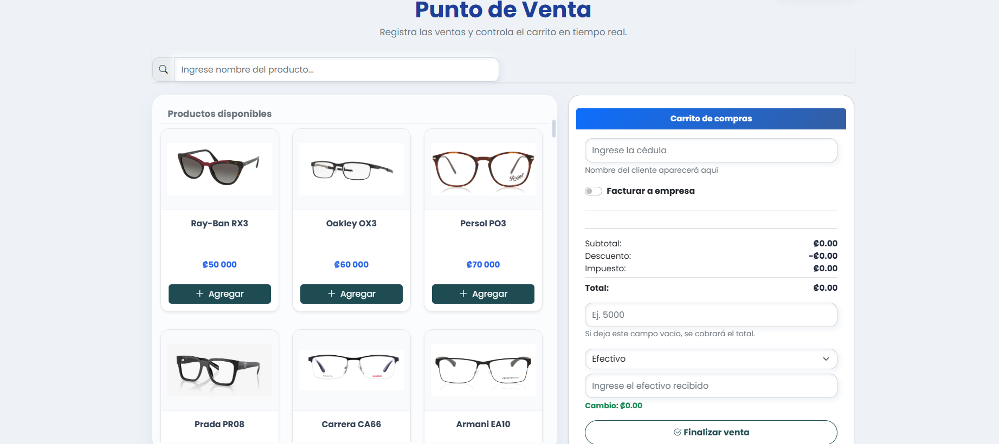
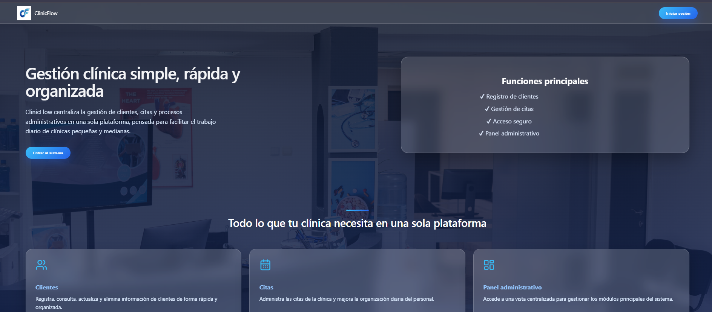
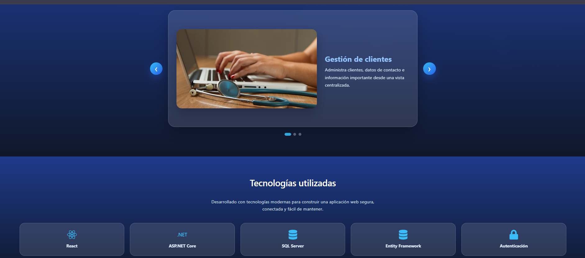

  

<h3 align="center">About Me</h3>

Junior Software Developer with a background in Information Systems and hands-on experience in Full Stack development, databases, REST APIs, and data analysis.</b>. 
I have worked on academic and real-world projects using C#, .NET, React, PHP, SQL, Power BI, and other data tools, building solutions that range from web applications to data analysis and business intelligence.

My current focus is on Software Development and Data & BI, while continuing to expand my technical knowledge through specialized training in Cybersecurity. 

 

<h3 align="center">Tech Stack</h3>

  

 

<h3 align="center">Data, Databases & Tools</h3>

  <b>SQL Server</b> •
  <b>Oracle</b> •
  <b>Oracle APEX</b> •
  <b>Power BI</b> •
  <b>KNIME</b> •
  <b>REST APIs</b> •
  <b>Jira</b>

 

<h2 align="center">Featured Projects</h2>

A selection of projects where I have applied software development, database design, APIs, and data analysis to solve practical problems.

 

## 01. OptiGestión | Optical Management System

**Real-world web application developed to digitalize and centralize the operational processes of an optical business.**

My work focused on the development of the **digital patient record and prescription system**, as well as improvements to the **Point of Sale, inventory management and cash closing modules**.

**Key features**
- Digital patient records and clinical history
- Prescription management
- Point of Sale (POS)
- Inventory management
- Billing and payment tracking
- Cash closing

**Tech:** `PHP` · `MySQL` · `JavaScript` · `HTML` · `CSS` · `Stored Procedures`

 

<table>
  <tr>
    <td width="50%" align="center">
      
       
      <b>Digital Patient Record</b> Clinical history and patient information management.
    </td>
    <td width="50%" align="center">
      
       
      <b>Point of Sale</b> Sales, products and payment processing.
    </td>
  </tr>
</table>

 

## 02. ClinicFlow | Full Stack Clinical Management System

**Full Stack web application developed to manage clients and appointments through a role-based clinical management system.**

The project integrates a **React frontend with an ASP.NET Core REST API and SQL Server**, implementing secure authentication, role-based authorization, appointment management, and differentiated experiences for clients and administrators.

**Key features**

- User registration and secure JWT authentication
- Role-based access for Clients and Administrators
- Client management with activation and deactivation
- Personal appointment scheduling, editing, and cancellation
- Administrative management of clients and appointments
- Protected REST API endpoints and password hashing
- Data persistence with Entity Framework Core and SQL Server

**Tech:** `React` · `Vite` · `JavaScript` · `C#` · `ASP.NET Core` · `Entity Framework Core` · `SQL Server` · `JWT` · `REST API` · `Swagger`

<table>
  <tr>
    <td width="50%" align="center">
      
       
    </td>
    <td width="50%" align="center">
      
       
    </td>
  </tr>
</table>
