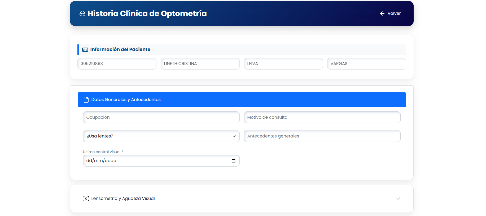

  

<h3 align="center">About Me</h3>

Junior Software Developer with experience in <b>web development, databases, APIs, and data analysis</b>. 
I enjoy building practical solutions to real-world problems and continuously improving my technical skills. 
Currently expanding my knowledge in <b>Cybersecurity</b> while strengthening my background in Software Development and Data.

 

<h3 align="center">Tech Stack</h3>

  

 

<h3 align="center">Data, Databases & Tools</h3>

  <b>SQL Server</b> •
  <b>Oracle</b> •
  <b>Oracle APEX</b> •
  <b>Power BI</b> •
  <b>KNIME</b> •
  <b>REST APIs</b> •
  <b>Jira</b>

 

<h2 align="center">Featured Projects</h2>

A selection of projects where I have applied software development, database design, APIs, and data analysis to solve practical problems.

 

### 01. OptiGestión | Optical Management System

**Real-world web application developed to digitalize and centralize the operational processes of an optical business.**

My work focused on the development of the **digital patient record and prescription system**, as well as improvements to the **Point of Sale, inventory management and cash closing modules**.

**Key features**
- Digital patient records and clinical history
- Prescription management
- Point of Sale (POS)
- Inventory management
- Billing and payment tracking
- Cash closing

**Tech:** `PHP` · `MySQL` · `JavaScript` · `HTML` · `CSS` · `Stored Procedures`

 

  

  Digital Patient Record module developed for OptiGestión.

